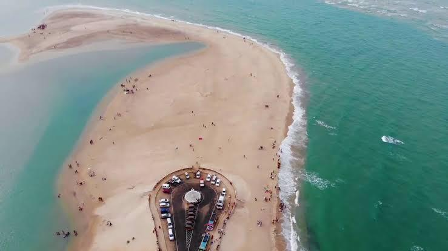

I planned a road trip from Madurai to Dhanushkodi (the last land of India) Tamilnadu. My best friend joined in the journey. He reached Madurai where I was staying at the time of this trip. I have taken a Hero Hf Deluxe bike for rent which is 100cc bike but me only two things were there in the brain that is bike rent should be less and mileage should be more.

Night 8 pm I received a bike from the vendor and went to the railway station to pick my friend who came from Hyderabad to Madurai. We stayed in Madurai for that night in a rented house where I used to stay.

### **First-day ride to the largest functioning Hindu temple in the world.**

we started the bike ride early morning at 5:03 AM and took the national highway to Trichy(Tiruchirappalli) which is 140 km and into the town, it's total of 165 km.

The best part of the morning ride on the highways is we can feel beautiful sunrise with clean blue sky and empty roads.

After three and a half hours of riding, by 8.30 AM, we reached Srirangam, the largest functioning Hindu temple in the world. The temple belongs to Lord Sri Ranganathaswamy.

The temple site is on a large island bounded by the Kaveri River and Kollidam River. The temple occupies an area of 155 acres (63 ha) with 81 shrines, 21 towers, 39 pavilions, and many water tanks integrated into the complex making it the world's largest functioning Hindu temple.
The temple complex has been nominated as a UNESCO World Heritage Site and is in UNESCO's tentative list

story continues......

Catch me on [Twitter](https://twitter.com/iamchaduvula).

Thank You for reading.
